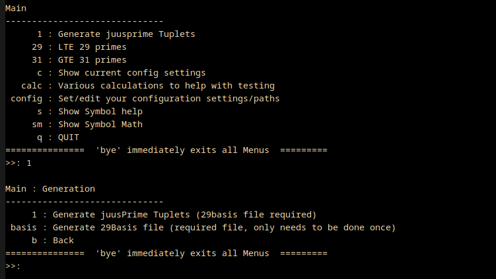

## juusprime_app : Generate prime Sextuplets / Tuplets, interactive linux terminal application ##

March 2021:

juusprime_app uses the juusprime go package. See that page for more
information about generating tuplets:
https://github.com/Juuliuus/juusprime

New as of 17 March 2021 (v1.1.0):
- improved offset algorithm has increased Tuplet generation speed by
  about 30%
- bug fix scanning issue for wanted effect in Human Readable option where
  choice was ignored.
- calc menu items now allow comma separated lists of input.  

See at bottom for other recent additions

This is an interactive terminal application interface to that package
and is written to make prime "Tuplet" (sextuplets and/or quintuplets
and/or quadruplets) generation painless.

If you do not use golang, then you can also download a
compiled, ready to run, executable from my website (you may need to
set it as executable before it will run):
Download page (gpg sig): https://www.timepirate.org/downloads.html
App Direct Download: https://www.timepirate.org/downloads/juusprime_app

### Usage ###

For new users to the program keep in mind that defaults are your
friends. Stick to those at first.

When the program first starts up it will ask you for some
configuration settings. There are, right now, only two:

The first is the path to where you want 29Basis files stored.

The second is the datapath to where you want Tuplet output files
stored.

Once that is finished you will be at the Main menu. As in the
screenshot above choose "1" at the main menu. This will open the
Generation menu.

* Automation:

New automation flags, Use "juusprime_app automate --help" to see all
Options. Example:

juusprime_app  automate -bf=/mypath/my29basis -out=./ -bfrom=0 -bto=1
-filter=1

File paths relative to application path are ok too.

* Generate 29Basis:

Before you can generate Tuplets you need a 29Basis file. So type
"basis" to start that process. It will take a minute or so, the file
will be ~190Mb. 

This only needs to be done once, this file is re-used over and over
again.

* Generate tuplets:

Then you can type the "1" choice from this Generate menu and begin to
generate tuplets any time you like. You will be asked...

-- Choose basis file:

It will always ask you which 29basis file to use.

<For new users, this will be the 29basis file you just created, and it
will be the default>

-- Generation by which method:

You will then be asked if you want to generate by basis, TNumber, or
natural integer number.

For beginners, use basis. The basis is 0 based, hence the first basis
is 0. Use that default first.

-- Choose Filtering type:

You will then be asked how to filter the output. 

If you choose "no filter" expect a run of about 30 minutes to generate
all the tuplets.

If you filter by Sextuplets the run will take about 1 minute to
generate all the sextuplets.

This is due to the large numbers of quintuplets and quadruplets
compared to the much less common sextuplet.

-- On to infinity:

Tuplet output is written to files beginning with "juusprime" and
having a .rawdata, .prettydata, and/or .info extension. They are just
text files, have a look at them. These will be written to the Datapath
you specified when setting your configuration.

Once you have done your basis-0, try generating some more tuplets but
this time with basis-1, then 2, and so on.

Want to know how many Sextuplets between 1,000,000 and 1,000,000,000?
Then run again, but this time try the Natural Integer numbers method
and put those figures as the from and to (without the commas).

Have fun.

### Some technical information ###

The above referenced "basis" file is a single, repeatable, cycle of TNumbers
(Template Numbers, a block 30 integers long). It is re-used each time
you change the Basis Number. Basis numbers start at 0, and then can go
up without limit.

When you do a tuplet generation by basis it encompasses the TNumbers
from 28 to 215656468 inclusive (the cycle is 215656441 TNumbers
long). This corresponds to an integer number range of 835 to
6,469,694,064. Each time you run by basis you will be analyzing this
many integers.

Running generation by basis numbers is recommended because that
ensures no numbers are missed, and your output files contain all the
tuplets that exist, in order.

-------------------------------------------------------------------------------

juusprime is free software, licensed under the GNU GPL, version 3. It
is written in pure Go. It has one dependency:

juusmenu (https://github.com/Juuliuus/juusmenu) 

which is also written in pure go.

-------------------------------------------------------------------------------

### History ###

v1.1.0 March 17 2021
- improved offset algorithm has increased Tuplet generation speed by
  about 30%
- bug fix scanning issue for wanted effect in Human Readable option where
  choice was ignored.
- calc menu items now allow comma separated lists of input.  

v1.0.1 March 5 2021
- Added flags for automation for shell scripts, etc. 
Use "juusprime_app automate --help" for that list.

v1.0.0 February 2021
